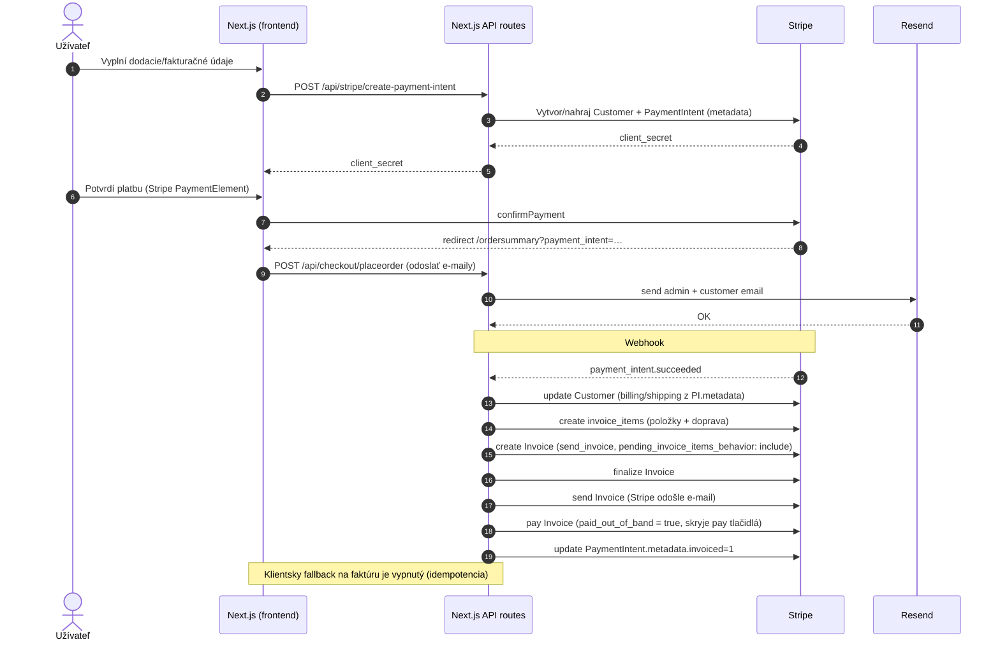

# Vino Putec - E-shop pre prémiové vína

**Vino Putec** je moderný e-shop pre prémiové vína z rodinnej vinárne vo Vinosadoch. Postavený na Next.js 15, TypeScript, Tailwind CSS a Redux, optimalizovaný pre malé obchody s až 200 produktmi.

## Architektúra a štruktúra projektu

- Framework: Next.js App Router (15.x), TypeScript, TailwindCSS
- Stav: Redux Toolkit (košík, checkout stav)
- Úložisko produktov: JSON súbory v `configs/` (bez databázy)
- Platby: Stripe Payment Element + Webhook (fakturácia)
- Emaily: Resend (potvrdenia objednávok)
- Hosting: Vercel (Node runtime pre webhook)

### Strom adresárov (výber)
- `app/`
  - `page.tsx` – domovská stránka
  - `products/` a `vina/` – listing a detail produktov
  - `pokladna/` – checkout (Shipping/Billing, Stripe element)
  - `ordersummary/` – zhrnutie po platbe
  - `api/` – API routy (Stripe, newsletter, kontakty…)
    - `stripe/create-payment-intent` – vytvorenie PI + prenesenie metadát
    - `stripe/webhook` – vystavenie a odoslanie faktúry (finalize → send → paid)
    - `checkout/placeorder` – odoslanie e-mailov cez Resend
- `configs/` – konfigurácie (wines.json, checkout.json, locale…)
- `public/` – obrázky (`/vina`, galérie, logá…)
- `store/` – Redux store, slices
- `docs/` – operatívny návod (`OPERATIONS.md`)

## Dátový model produktov (JSON)

- Zdroj pravdy: `configs/wines.json`
- Povinné polia: `Id`, `Name`, `Slug`, `RegularPrice`/`SalePrice`, `Currency`, `Image`, `Category`
- Obrázky: `public/vina/...` a v JSON sa referencujú cestou `/vina/xyz.jpg`

Pridanie produktu:
1. Nahraj obrázok do `public/vina/`
2. Pridaj záznam do `configs/wines.json`
3. Deploy (Vercel) – produkt sa zobrazí v liste a má detail cez `Slug`

## O nás

Putec s.r.o. je rodinná vinárňa s dlhoročnou tradíciou vo Vinosadoch, ktorá sa špecializuje na výrobu prémiových vín. Naša história sa začala s láskou k vinohradníctvu a túžbou vytvoriť vína, ktoré odrážajú jedinečnú chuť našej krajiny.

## Kontakt

- **Adresa**: Pezinská 154, 902 01 Vinosady, Slovensko
- **Telefón**: +421 903465666
- **Email**: brano.putec@gmail.com
- **IČO**: 36658774
- **DIČ**: 2022219430
- **IČ DPH**: SK2022219430
- **IBAN**: SK08 7500 0000 0040 3035 3200

## Funkcie

- **Bez databázy** – Produkty sú uložené v JSON súboroch
- **Rýchly a ľahký** – Postavený na Next.js a optimalizovaný pre výkon
- **Košík a objednávka** – LocalStorage košík s Stripe a dobierkou
- **Newsletter integrácia** – Prihlásenie na newsletter
- **Kontaktný formulár s Google reCAPTCHA v3** – Ochrana pred spamom
- **Spracovanie objednávok cez email** – Používa Resend na odosielanie notifikácií
- **SEO optimalizovaný** – Rýchle, indexovateľné stránky produktov
- **Nasadenie kdekoľvek** – Funguje na Vercel alebo akomkoľvek statickom hostingu

## Technológie

- **Frontend**: Next.js 15, TypeScript, Tailwind CSS, Redux
- **Úložisko**: JSON-based súborový systém (bez databázy)
- **Platby**:
  - **Stripe Payment Element** – Vložené platby kartou
  - **Dobierka** – Platba pri dodaní
- **Hosting**: Vercel alebo akýkoľvek statický hosting

## Optimalizácia obrázkov (výkon a SEO)

- Používame `next/image` s optimalizáciou zapnutou v `next.config.ts` (formáty `AVIF`/`WebP`).
- Všetky obrázky v `public/` sú zmenšované in‑place skriptom (zachovaná logická štruktúra priečinkov):

Skripty:

```bash
# náhľad bez zmien (DRY RUN)
npm run images:dry

# ostrá optimalizácia (prepíše pôvodné súbory menšími a recompressnutými)
npm run images:optimize
```

Čo skript robí:
- obmedzí šírku veľkých fotiek na max 2000 px a recompressne podľa prípony:
  - JPEG → mozjpeg ~75
  - PNG → compressionLevel 9 + paleta
  - WebP/AVIF → primeraná kvalita
- logo `public/putec-logo.jpg` zmenšuje na 160 px pre malé použitie.
- DRY RUN: nastav `DRY_RUN=1` (používa `cross-env`) alebo `npm run images:dry`.

Poznámky k komponentom:
- `Hero` má `sizes="100vw"` a používa `fill`.
- Karty produktov používajú validné `width/height` + `sizes` pre responzívne načítanie.

## Nákupný proces – sekvenčný diagram



## Stripe integrácia a fakturácia

- **Produkčná Webhook URL**: `https://vino-putec.vercel.app/api/stripe/webhook`
- **Primárny event**: `payment_intent.succeeded` (ostatné len na debug počas testov)
- **Lokalizácia**: nastavujeme `customer.preferred_locales: ['sk', 'sk-SK']`
- **Poradie fakturácie**:
  1) Z PI.metadata prečítame položky (`item_{i}_title|qty|price_cents`) a dopravu (`shippingMethod`, `shippingPriceCents`)
  2) Vyčistíme čakajúce `invoice_items` s prefixom `[orderId]`
  3) Vytvoríme `invoice_items` (položky + doprava)
  4) `invoices.create` s `collection_method: send_invoice`, `auto_advance: false`, `pending_invoice_items_behavior: 'include'`
  5) `invoices.finalize`
  6) `invoices.send` (Stripe odošle e‑mail s faktúrou)
  7) `invoices.pay(..., { paid_out_of_band: true })` (skryje platobné tlačidlá; v produkcii zostane stav "paid")
  8) `payment_intent.metadata.invoiced = '1'`

### Idempotencia (bez duplicitných položiek/e‑mailov)
- Strážime `PaymentIntent.metadata.invoiced === '1'`
- Hľadáme existujúce faktúry podľa `metadata['orderId']` a popisu
- Pred vytvorením položiek zmažeme čakajúce `invoice_items` obsahujúce `[orderId]`
- Klientsky fallback endpoint je vypnutý (len ping/log režim)

### Aké údaje sa prenášajú do Stripe
- `PaymentIntent.metadata` obsahuje:
  - `orderId`, `item_{i}_title`, `item_{i}_qty`, `item_{i}_price_cents`
  - `shippingMethod`, `shippingPriceCents`
  - billing_* a shipping_* polia (meno, adresa, e‑mail, …)
  - firemné údaje: `billing_company_name`, `billing_company_ico`, `billing_company_dic`, `billing_company_icdph`
- Pred faktúrou aktualizujeme `Customer` (meno, e‑mail, adresy, `preferred_locales`, firemné údaje v `customer.metadata`)

### Testovanie (lokálne)
```bash
stripe listen --forward-to localhost:3000/api/stripe/webhook
# nastav STRIPE_WEBHOOK_SECRET podľa výstupu listen
npm run dev
```
V logu uvidíš: „➕ Created N invoice_items…“, „📧 Stripe will send invoice email“, „✅ Invoice marked paid …“.

### Produkčný checklist
- [ ] `STRIPE_SECRET_KEY` v `.env`
- [ ] `STRIPE_WEBHOOK_SECRET` pre `https://vino-putec.vercel.app/api/stripe/webhook`
- [ ] Stripe Dashboard → Email settings → povolené odosielanie faktúr (prod)
- [ ] Webhook events: len `payment_intent.succeeded` (ostatné vypnuté)
- [ ] Over test: kartová platba → v Stripe „Invoice: paid“, zákazník dostane e‑mail

### Poznámka k e‑mailom (test vs. produkcia)
## API prehľad

- `GET /api/wines` – načítanie produktov z `configs/wines.json`
- `POST /api/stripe/create-payment-intent` – vytvorenie PaymentIntent, uloženie metadát (položky košíka, doprava, billing/shipping, firemné údaje)
- `POST /api/stripe/webhook` – prijíma `payment_intent.succeeded`, vytvára `invoice_items`, `invoices.create` (send_invoice), `finalize`, `send`, `pay(out_of_band)`, nastaví `PI.metadata.invoiced='1'`
- `POST /api/checkout/placeorder` – po redirecte pošle potvrdenia (Resend)

## Checkout UX

- Platobné metódy sa aktivujú hneď po vyplnení dopravy (billing sa predvyplní ako shipping, ak nie je zvolené „iná fakturačná adresa“)
- Podpora firmy (IČO/DIČ/IČ DPH) – prenášané do Stripe (Customer + metadata) pre zobrazenie na faktúre

## Nastavenie prostredia

- `.env.local` (lokálne), Vercel Env (produkcia)
- Kľúče (výber):
  - `STRIPE_SECRET_KEY` – test/live podľa režimu
  - `STRIPE_WEBHOOK_SECRET` – podľa Stripe endpointu (test/live)
  - `RESEND_API_KEY` – pre odosielanie potvrdení

## Nasadenie (Vercel)

- Webhook route beží na Node runtime (nie edge): `export const runtime='nodejs'`
- Webhook endpoint v Stripe: `https://vino-putec.vercel.app/api/stripe/webhook`, event: `payment_intent.succeeded`
- Pre produkciu použi LIVE kľúče a LIVE webhook secret

## Prečo nevyužívame Stripe Products teraz

- Zdroj pravdy ostáva v JSON kvôli kontrole vizuálu, rýchlosti a jednoduchosti
- V budúcnosti je možné doplniť paralelne Stripe Products/Prices pre reporting/Tax bez zmeny UI (voliteľné)

- V test móde Stripe e‑maily často neodosiela, pokiaľ nie je zapnuté „Send emails in test mode“ v Settings → Email → Customer emails.
- V produkcii sa e‑maily odosielajú po `invoices.send` automaticky (po nasadení LIVE kľúčov a LIVE webhooku).


Poznámky:
- Faktúry: idempotencia podľa `orderId` a `PI.metadata.invoiced` + čistenie čakajúcich `invoice_items`.
- E‑maily: odosielané cez Resend (potvrdenia) a fallback e‑mail s odkazom na faktúru.
- Zber dát: billing/shipping + firma/IČO/DIČ/IČ DPH → PI.metadata a Stripe Customer (kvôli zobrazeniu na faktúre).

## Spustenie

### Klonovanie repozitára
```sh
git clone https://github.com/Abra7abra7/vino-putec.git
cd vino-putec
```

### Inštalácia závislostí
```sh
npm install
```

### Konfigurácia

**/configs/products.json** - Obsahuje všetky údaje o produktoch pre váš obchod. Každý produkt obsahuje polia ako:
- ID, Názov, Slug, Krátky popis, Dlhý popis
- Bežná cena, Zľavová cena, Mena, Obrázok produktu
- Galéria obrázkov, Kategória, Typ predplatného, atď.

**/configs/locale.en.json** - Spravuje všetok lokalizovaný obsah pre rozhranie vášho obchodu vrátane:
- UI labely (tlačidlá, správy)
- Položky navigačného menu
- Footer a kontaktné informácie
- Sociálne médiá
- Obsah domovskej a o nás stránky

**/configs/checkout.json** - Definuje všetky nastavenia súvisiace s checkout skúsenosťou:
- Spôsoby dopravy: Názvy, ceny a meny
- Dostupné krajiny: Samostatné zoznamy pre krajiny dopravy a fakturácie
- Spôsoby platby: Zahŕňa Stripe a dobierku s možnosťami zapnúť/vypnúť

**/.env.local** – Ukladá citlivé premenné prostredia a konfiguráciu runtime pre váš obchod

### Nastavenie environment premenných
```sh
# Skopírujte príklad súboru
cp env.example .env.local

# Upravte .env.local s vašimi skutočnými API kľúčmi
# Všetky služby sú voliteľné - e-shop funguje aj bez nich
```

### Spustenie development servera
```sh
npm run dev
```

Potom otvorte http://localhost:3000 vo vašom prehliadači.

**Poznámka:** E-shop funguje aj bez nastavenia API kľúčov. Platobné metódy a newsletter budú dostupné až po nastavení príslušných služieb.

## Licencia

Vino Putec je vydaný pod MIT licenciou.

## Podpora

Ak nájdete tento projekt užitočný, zvážte podporu našej práce. Vaša podpora nám pomáha udržiavať tento projekt nažive a ďalej ho zlepšovať.

Ďakujeme! ❤️

---

### Administrátor: Operácie a podpora
- Podrobný operatívny návod pre Stripe a fakturáciu: `docs/OPERATIONS.md`