# Vino Putec - E-shop pre prémiové vína

**Vino Putec** je moderný e-shop pre prémiové vína z rodinnej vinárne vo Vinosadoch. Postavený na Next.js 15, TypeScript, Tailwind CSS a Redux, optimalizovaný pre malé obchody s až 200 produktmi.

## O nás

Putec s.r.o. je rodinná vinárňa s dlhoročnou tradíciou vo Vinosadoch, ktorá sa špecializuje na výrobu prémiových vín. Naša história sa začala s láskou k vinohradníctvu a túžbou vytvoriť vína, ktoré odrážajú jedinečnú chuť našej krajiny.

## Kontakt

- **Adresa**: Pezinská 154, 902 01 Vinosady, Slovensko
- **Telefón**: +421 903465666
- **Email**: brano.putec@gmail.com
- **IČO**: 36658774
- **DIČ**: 2022219430
- **IČ DPH**: SK2022219430
- **IBAN**: SK08 7500 0000 0040 3035 3200

## Funkcie

- **Bez databázy** – Produkty sú uložené v JSON súboroch
- **Rýchly a ľahký** – Postavený na Next.js a optimalizovaný pre výkon
- **Košík a objednávka** – LocalStorage košík s Stripe a dobierkou
- **Newsletter integrácia** – Prihlásenie na newsletter
- **Kontaktný formulár s Google reCAPTCHA v3** – Ochrana pred spamom
- **Spracovanie objednávok cez email** – Používa Resend na odosielanie notifikácií
- **SEO optimalizovaný** – Rýchle, indexovateľné stránky produktov
- **Nasadenie kdekoľvek** – Funguje na Vercel alebo akomkoľvek statickom hostingu

## Technológie

- **Frontend**: Next.js 15, TypeScript, Tailwind CSS, Redux
- **Úložisko**: JSON-based súborový systém (bez databázy)
- **Platby**:
  - **Stripe Payment Element** – Vložené platby kartou
  - **Dobierka** – Platba pri dodaní
- **Hosting**: Vercel alebo akýkoľvek statický hosting

## Nákupný proces – sekvenčný diagram

```mermaid
sequenceDiagram
  autonumber
  actor U as Užívateľ
  participant FE as Next.js (frontend)
  participant API as Next.js API routes
  participant S as Stripe
  participant R as Resend

  U->>FE: Vyplní dodacie/fakturačné údaje
  FE->>API: POST /api/stripe/create-payment-intent
  API->>S: Vytvor/nahraj Customer + PaymentIntent (metadata)
  S-->>API: client_secret
  API-->>FE: client_secret

  U->>FE: Potvrdí platbu (Stripe PaymentElement)
  FE->>S: confirmPayment
  S-->>FE: redirect /ordersummary?payment_intent=…

  FE->>API: POST /api/checkout/placeorder (odoslať e‑maily)
  API->>R: send admin + customer email
  R-->>API: OK

  Note over S,API: Webhook
  S-->>API: payment_intent.succeeded
  API->>S: update Customer (billing/shipping z PI.metadata)
  API->>S: create invoice_items (položky + doprava)
  API->>S: create Invoice (send_invoice, pending_invoice_items_behavior: include)
  API->>S: finalize Invoice
  API->>S: send Invoice (Stripe odošle e‑mail)
  API->>S: pay Invoice (paid_out_of_band = true, skryje pay tlačidlá)
  API->>S: update PaymentIntent.metadata.invoiced=1

  Note over FE,API: Klientsky fallback na faktúru je vypnutý (idempotencia)
```



## Stripe integrácia a fakturácia

- **Produkčná Webhook URL**: `https://vino-putec.vercel.app/api/stripe/webhook`
- **Primárny event**: `payment_intent.succeeded` (ostatné len na debug počas testov)
- **Lokalizácia**: nastavujeme `customer.preferred_locales: ['sk', 'sk-SK']`
- **Poradie fakturácie**:
  1) Z PI.metadata prečítame položky (`item_{i}_title|qty|price_cents`) a dopravu (`shippingMethod`, `shippingPriceCents`)
  2) Vyčistíme čakajúce `invoice_items` s prefixom `[orderId]`
  3) Vytvoríme `invoice_items` (položky + doprava)
  4) `invoices.create` s `collection_method: send_invoice`, `auto_advance: false`, `pending_invoice_items_behavior: 'include'`
  5) `invoices.finalize`
  6) `invoices.send` (Stripe odošle e‑mail s faktúrou)
  7) `invoices.pay(..., { paid_out_of_band: true })` (skryje platobné tlačidlá; v produkcii zostane stav "paid")
  8) `payment_intent.metadata.invoiced = '1'`

### Idempotencia (bez duplicitných položiek/e‑mailov)
- Strážime `PaymentIntent.metadata.invoiced === '1'`
- Hľadáme existujúce faktúry podľa `metadata['orderId']` a popisu
- Pred vytvorením položiek zmažeme čakajúce `invoice_items` obsahujúce `[orderId]`
- Klientsky fallback endpoint je vypnutý (len ping/log režim)

### Aké údaje sa prenášajú do Stripe
- `PaymentIntent.metadata` obsahuje:
  - `orderId`, `item_{i}_title`, `item_{i}_qty`, `item_{i}_price_cents`
  - `shippingMethod`, `shippingPriceCents`
  - billing_* a shipping_* polia (meno, adresa, e‑mail, …)
  - firemné údaje: `billing_company_name`, `billing_company_ico`, `billing_company_dic`, `billing_company_icdph`
- Pred faktúrou aktualizujeme `Customer` (meno, e‑mail, adresy, `preferred_locales`, firemné údaje v `customer.metadata`)

### Testovanie (lokálne)
```bash
stripe listen --forward-to localhost:3000/api/stripe/webhook
# nastav STRIPE_WEBHOOK_SECRET podľa výstupu listen
npm run dev
```
V logu uvidíš: „➕ Created N invoice_items…“, „📧 Stripe will send invoice email“, „✅ Invoice marked paid …“.

### Produkčný checklist
- [ ] `STRIPE_SECRET_KEY` v `.env`
- [ ] `STRIPE_WEBHOOK_SECRET` pre `https://vino-putec.vercel.app/api/stripe/webhook`
- [ ] Stripe Dashboard → Email settings → povolené odosielanie faktúr (prod)
- [ ] Webhook events: len `payment_intent.succeeded` (ostatné vypnuté)
- [ ] Over test: kartová platba → v Stripe „Invoice: paid“, zákazník dostane e‑mail


Poznámky:
- Faktúry: idempotencia podľa `orderId` a `PI.metadata.invoiced` + čistenie čakajúcich `invoice_items`.
- E‑maily: odosielané cez Resend (potvrdenia) a fallback e‑mail s odkazom na faktúru.
- Zber dát: billing/shipping + firma/IČO/DIČ/IČ DPH → PI.metadata a Stripe Customer (kvôli zobrazeniu na faktúre).

## Spustenie

### Klonovanie repozitára
```sh
git clone https://github.com/Abra7abra7/vino-putec.git
cd vino-putec
```

### Inštalácia závislostí
```sh
npm install
```

### Konfigurácia

**/configs/products.json** - Obsahuje všetky údaje o produktoch pre váš obchod. Každý produkt obsahuje polia ako:
- ID, Názov, Slug, Krátky popis, Dlhý popis
- Bežná cena, Zľavová cena, Mena, Obrázok produktu
- Galéria obrázkov, Kategória, Typ predplatného, atď.

**/configs/locale.en.json** - Spravuje všetok lokalizovaný obsah pre rozhranie vášho obchodu vrátane:
- UI labely (tlačidlá, správy)
- Položky navigačného menu
- Footer a kontaktné informácie
- Sociálne médiá
- Obsah domovskej a o nás stránky

**/configs/checkout.json** - Definuje všetky nastavenia súvisiace s checkout skúsenosťou:
- Spôsoby dopravy: Názvy, ceny a meny
- Dostupné krajiny: Samostatné zoznamy pre krajiny dopravy a fakturácie
- Spôsoby platby: Zahŕňa Stripe a dobierku s možnosťami zapnúť/vypnúť

**/.env.local** – Ukladá citlivé premenné prostredia a konfiguráciu runtime pre váš obchod

### Nastavenie environment premenných
```sh
# Skopírujte príklad súboru
cp env.example .env.local

# Upravte .env.local s vašimi skutočnými API kľúčmi
# Všetky služby sú voliteľné - e-shop funguje aj bez nich
```

### Spustenie development servera
```sh
npm run dev
```

Potom otvorte http://localhost:3000 vo vašom prehliadači.

**Poznámka:** E-shop funguje aj bez nastavenia API kľúčov. Platobné metódy a newsletter budú dostupné až po nastavení príslušných služieb.

## Licencia

Vino Putec je vydaný pod MIT licenciou.

## Podpora

Ak nájdete tento projekt užitočný, zvážte podporu našej práce. Vaša podpora nám pomáha udržiavať tento projekt nažive a ďalej ho zlepšovať.

Ďakujeme! ❤️

---

### Administrátor: Operácie a podpora
- Podrobný operatívny návod pre Stripe a fakturáciu: `docs/OPERATIONS.md`